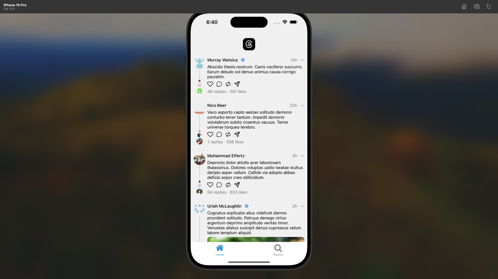

# Threads Clone Project

A simple Threads app clone built with React Native, utilizing Lottie Animations, Yarn for package management, Expo CLI, Expo Router, and Expo Images.

## Getting Started

Follow these steps to get the project up and running on your local machine.

---

### Technologies Used

- React Native
- Lottie Animations
- Yarn
- Expo CLI
- xpo Router
- Expo Images

---

### Preview



---

### Prerequisites

- Node.js: Make sure you have Node.js installed. You can download it from [here](https://nodejs.org/).

- Yarn: Install Yarn globally by running the following command:

 ```bash
 npm install -g yarn
 ```

- Expo CLI: Install Expo CLI globally using:

 ```bash
 npm install -g expo-cli
 ```

### Installing

1. Clone the repository:

  ```bash
  git clone [https://github.com/CodeNKoffee/threads-clone.git](https://github.com/CodeNKoffee/threads-clone.git)
  ```

2. Navigate to the project directory:

  ```bash
  cd threads-clone
  ```

3. Install dependencies using Yarn:

  ```bash
  yarn install
  ```

### Running the App

Start the Expo development server:

```bash
expo start
```
## Contributing

Contributions are welcome! Feel free to submit issues and pull requests.

## License

This project is licensed under the MIT License - see the [LICENSE](LICENSE) file for details.

## Acknowledgments

- This project was inspired by [original-threads-app](https://github.com/threadsapp/original-threads-app).
